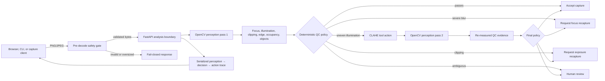

# HAL LabSight Architecture

LabSight is a deterministic image-quality-control workflow. OpenCV observations
drive later actions; the service does not identify biology or make clinical
claims.

## Runtime data flow



The agentic edge is `P1 → C → V2 → P2`: a visual result invokes a tool and
changes the later observation and decision. A static caption or preselected demo
response cannot satisfy this contract.

## Evidence and provenance flow

```mermaid
flowchart TB
    S[Git source SHA] --> B[Source-bound production image]
    D[Exact OpenCV wheel + cv2 runtime] --> B
    B --> H[/health provenance]
    B --> J[Judge scenarios and browser recording]
    L[Frozen selection lock] --> X[Offline challenge evaluation]
    P[Frozen policy + metric hashes] --> X
    B --> X
    X --> Q[Metrics, failures, latency, receipt hashes]
    H --> Z[Readiness evidence]
    J --> Z
    Q --> Z
    Z --> G{Fail-closed submission gate}
```

Evidence is accepted only when its runtime and source identities match the
expected commit. The challenge selection is locked before scoring and excludes
development ancestry by raw-byte and decoded-pixel fingerprints. Recording
artifacts include observed responses and SHA-256 manifests rather than relying on
screenshots alone.

## Component responsibilities

| Component | Responsibility | Failure behavior |
| --- | --- | --- |
| Browser UI | Capture/upload, readable metrics and traces, evidence export | Shows bounded HTTP/network/format errors and clears stale evidence |
| Input gate | Codec, encoded-size, dimension, pixel-count and decoded-shape validation | Rejects before OpenCV decode |
| Metrics | Deterministic OpenCV measurements | Returns explicit numerical evidence |
| Agent policy | Maps evidence to first and final actions | Routes ambiguity to recapture or human review |
| CLAHE tool | Corrects uneven illumination | Always followed by a second measurement pass |
| API | Request IDs, timing, provenance, trace serialization | Does not emit diagnostic conclusions |
| Evaluation tools | Synthetic regression and frozen-source challenge scoring | Refuse source, runtime, policy or hash mismatch |
| Readiness gate | Separates local/CI/container/AWS/submission evidence | Missing evidence remains failed, never inferred |

## Trust boundaries

- Uploaded images are untrusted. They are bounded and validated before decode.
- Image bytes and filenames are excluded from exported evidence and structured
  operational logs.
- The host Python environment is not trusted for competition-runtime claims;
  distribution metadata and `cv2.__version__` must both match exactly.
- A local image digest is not an ECR registry digest, CI is not AWS execution, and
  repository configuration is not deployment evidence.
- Human review remains the authority for ambiguous capture quality and for the
  final video, eligibility, tax, and submission attestations.

## Local and CI execution

The production container runs as a non-root user. The hardened local canary and
source-disjoint challenge use a read-only root filesystem, tmpfs scratch space,
dropped Linux capabilities, `no-new-privileges`, bounded CPU and memory, and no
network during evaluation. GitHub Actions separately verifies development tests,
the exact OpenCV 5 runtime, live container HTTP behavior, and the browser recording
workflow.

## Preserved AWS target

```mermaid
flowchart LR
    G[Committed source] --> C[Source-bound Docker build]
    C --> E[ECR immutable digest]
    E --> A[AWS App Runner revision]
    A --> H[/health source + runtime proof]
    A --> W[CloudWatch / App Runner logs]
    A --> V[Deployed synthetic + frozen-corpus evaluation]
    H --> R[Final evidence document]
    W --> R
    V --> R
```

The ECR → App Runner design and evidence tools remain intact, but authenticated
AWS execution is deferred by the user. No cloud runtime, endpoint, registry
digest, or telemetry is claimed. The diagram describes the required target, not
the present deployment state.
