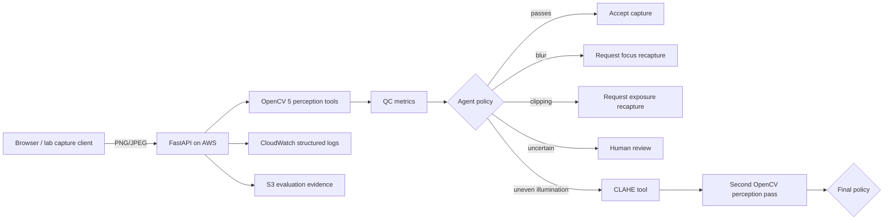

# Architecture

```mermaid
flowchart LR
    U[Browser / lab capture client] -->|PNG/JPEG| A[FastAPI on AWS]
    A --> V[OpenCV 5 perception tools]
    V --> M[QC metrics]
    M --> P{Agent policy}
    P -->|passes| OK[Accept capture]
    P -->|blur| F[Request focus recapture]
    P -->|clipping| E[Request exposure recapture]
    P -->|uncertain| H[Human review]
    P -->|uneven illumination| C[CLAHE tool]
    C --> V2[Second OpenCV perception pass]
    V2 --> P2{Final policy}
    A --> L[CloudWatch structured logs]
    A --> S[S3 evaluation evidence]
```

The important agentic edge is `P → C → V2`: a visual observation causes a later tool call and a new perception cycle rather than ending in a static prediction.
